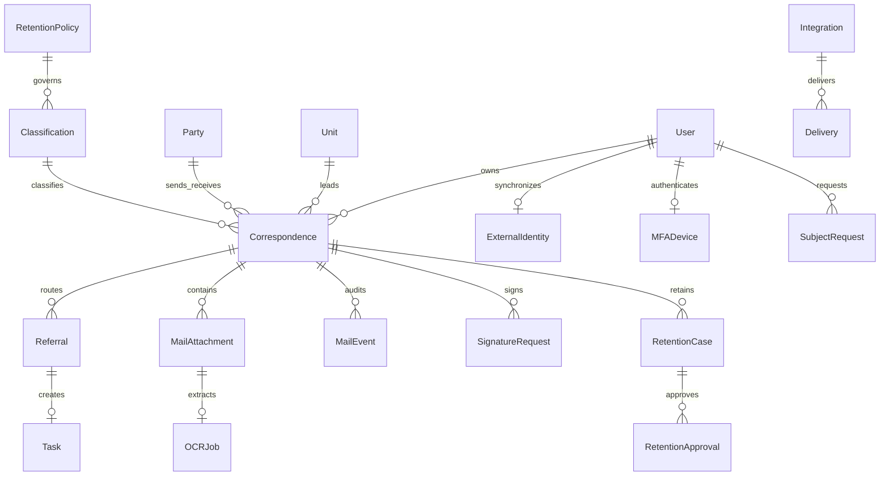
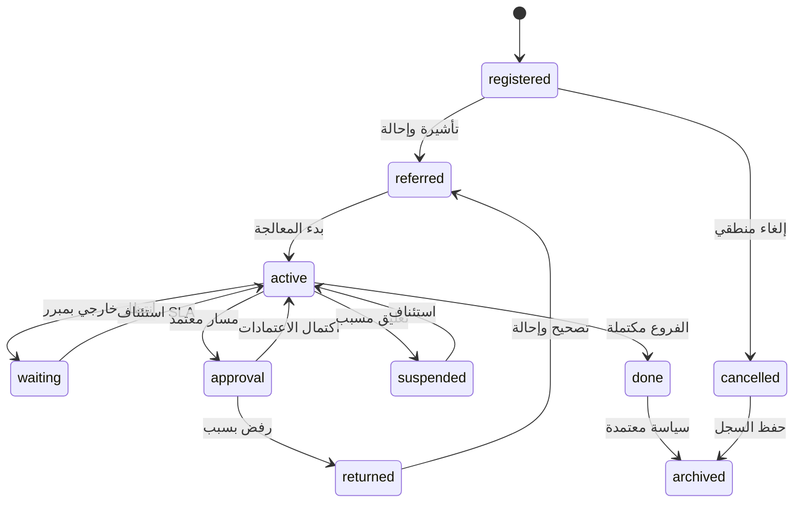
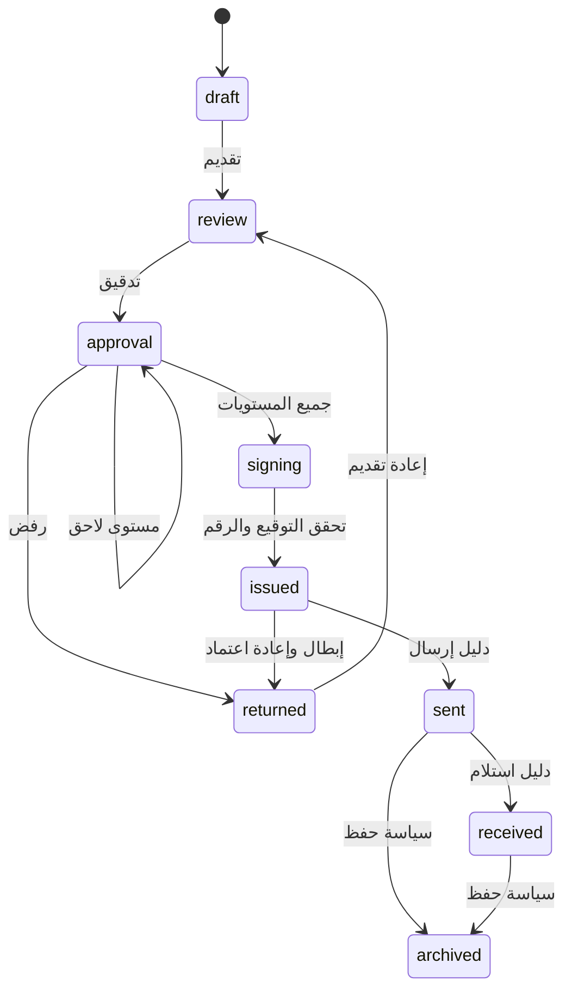

# التصميم الوظيفي والمعماري — 0.3.0

نطاق الوثيقة: تفاصيل قابلة للتنفيذ للوحدة الجديدة إلى جانب المهام والقرارات القائمة. [SRS](SRS.md)، [الامتثال](COMPLIANCE.md)، [عقد التكامل](INTEGRATIONS.md)، [الإطلاق](ROLLOUT.md).

## نموذج العلاقات

## حالات الوارد

## حالات الصادر

## الصلاحيات: فعل × دور × سرية

| الفعل | موظف | مدير وحدة | سكرتارية/assistant | تنفيذي | امتثال | مدقق/viewer | مسؤول النظام | مجلس |
|---|---|---|---|---|---|---|---|---|
| قراءة public | نعم | نعم | نعم | نعم | نعم | نعم | لا | قراءة فقط |
| قراءة internal | ملكية/إحالة | وحدته | ضمن التشغيل | ضمن التشغيل | وفق الوصول | وحدته | لا | تصريح فقط |
| قراءة restricted/secret | قائمة مباشرة | قائمة مباشرة | قائمة مباشرة | قائمة مباشرة | قائمة مباشرة | قائمة مباشرة | لا | تصريح مباشر |
| إنشاء صادر | وحدته | وحدته | نعم | نعم | الدور الأساسي | لا | لا | لا |
| تسجيل وارد | register | نعم | نعم | نعم | register | لا | لا | لا |
| تعديل مسودة | المعد/المسؤول | وحدته | نعم | نعم | الدور الأساسي | لا | لا | لا |
| إحالة/إنجاز وارد | register | وحدته | نعم | نعم | register | لا | لا | لا |
| اعتماد مستوى | لا | مصفوفة | مصفوفة | مصفوفة | الدور المخول | لا | لا | لا |
| توقيع | معين مخول | معين مخول | معين مخول | معين مخول | لا تلقائياً | لا | لا | لا |
| تغيير قائمة المحمي/إذن إخراج | لا | لا | لا | نعم | لا | لا | لا | لا |
| لجنة الاستبقاء | عضوية مستقلة | عضوية مستقلة | عضوية مستقلة | عضوية مستقلة | عضوية مستقلة | عضوية مستقلة | لا | عضوية مصرح بها |
| سجل معالجة/استجابة خصوصية | طلبه | طلبه | طلبه | إدارة | إدارة | طلبه | طلبه | طلبه |
| إعداد المستخدم/الوحدة | لا | لا | لا | لا | لا | لا | نعم؛ HR يمنع الإدخال المكرر | لا |
| إعداد تكامل ومراجع | لا | لا | قالب إذا مخول | قالب إذا مخول | قالب إذا مخول | لا | نعم | لا |

كل نعم مقيدة بالوصول للسجل، الحالة، الفصل عن المعد، نشاط الحساب، وسياسة المرفقات. السمات لا توسع سرية المحتوى. API يعيد تطبيق القواعد نفسها.

## Wireframes أربع لوحات

| اللوحة | أعلى الشاشة | قائمة العمل الرئيسية | لوحة متابعة | إجراء أساسي |
|---|---|---|---|---|
| الموظف | المسند/المعلق/متأخر | وارد مسند وإحالات | تنبيه SLA والأسباب | بدء/رد/إتمام إحالة |
| السكرتارية | حجم القيد/وارد مفتوح/اعتماد | صندوق الوارد والصادر | الإحالة الأولى/قائمة الجهات | تسجيل وإحالة |
| مدير الإدارة | SLA الوحدة/الاعتمادات | سجلات الوحدة والفروع | زمن الإنجاز/المتأخر | اعتماد/إحالة/تصعيد |
| التنفيذي | SLA90%/زمن الإحالة/رفض | سجلات ضمن الصلاحية | تقارير الوحدات/الجهات الإشرافية | استثناء مسبب/إذن/قرار استبقاء |

تفاصيل السجل: Metadata ثم النص، المرفقات، الإحالات والمهام، حالة الاعتماد، خط زمني، صفحة التوقيع/النسخ/الاستبقاء. تصميم الهاتف يحول صفوف الجدول إلى حقول مسماة، ويحتفظ بالخيار الجماعي وإجراءات اعتماد واضحة. خمسة اختبارات بشرية لازمة لتأكيد الزمن المحدد، لا بديل عنها باختبار Django.

## معاملات وحدود

- كل تغير حالة وتخصيص Sequence وتدقيق داخل transaction.atomic مع select_for_update.
- queue قابلة لإعادة المحاولة مع lease؛ المورد مسؤول عن Idempotency-Key لمنع إرسال خارجي مزدوج بعد انقطاع الشبكة.
- الملفات لا تتاح عبر MEDIA_URL؛ FileResponse بعد ACL. AES-GCM لا يغني عن تشفير قاعدة البيانات والقرص.
- لا تسمح قوالب/Merge بتشغيل كود أو تحميل مورد من الشبكة.
- بيانات المصدر لها external IDs مستقرة؛ حدث HR كامل لا يمنح دور admin/executive ولا يحذف من غاب ضمنياً.
- أثر إتلاف الملف خارج معاملة DB لا يمكن تراجعه؛ لهذا يجب السند والموافقة والمحضر وإثبات نسخ الأرشيف قبل أي تنفيذ، ويحفظ سجل المرجع والبصمة.

## المعايير غير الوظيفية

API p95<2s، RPO≤1h/RTO≤4h، WCAG2.1AA، TLS1.2+، AES256، MFA، حد رفع 10MB، دفعة API حتى 100 سجل، HR حتى 10000 موظف، OCR حتى 100 صفحة افتراضياً. الأرقام حدود/أهداف تصميم، وليست نتائج حمل إنتاج مثبتة. التنبيهات لا تحتوي أسراراً، وعطل المورد لا يسقط طلباً مسجلاً.
